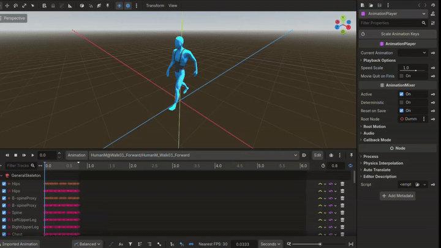
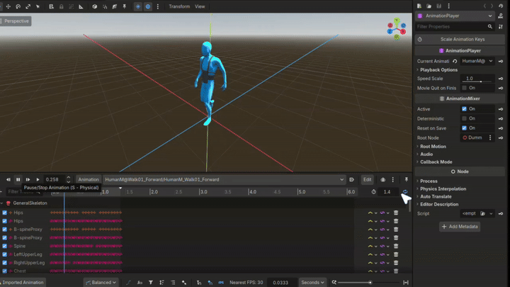

# Keyframe-Scaling
A Godot addon to scale the keyframes of an animation to any desired length for selected tracks or all tracks.

## How to Insall

1. Download the repo as Zip.
2. Copy the contents of the [addons](addons/) folder in inside your godot project, something like this -> *res://addons/Keyframe Scaling*
3. Reload the current project.
4. **In Godot** > **Project Settings** > **Plugins** > *enable* **Keyframe Scaling**

## How to use
There the usage is very simple :
1. Select the animation in the **Animation Player** node.
2. Press the **Scale Animation Keys** button in the inspector panel.
3. Set the final animation length you want.
4. If you want to apply the scaling in all the animation tracks then just click **OK**

5. If you want to apply the scaling in certain tracks then unselect the tracks in which the scaling must not apply.
6. Enable **Only Selected Tracks**
7. Click **OK**

If you want to see the demo in better quality, check the MP4 files in the [demo](demo/) folder.
